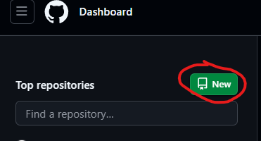

# prise en main git 
Comment créer un dépôt, travailler localement et pousser les modifications sur github
------------------------

- **Étape 1 : Créer un dépôt sur GitHub**
Allez sur GitHub :

Ouvrez votre navigateur et accédez à GitHub.
Si vous n'avez pas encore de compte, créez-en un.
Créer un nouveau dépôt :

Cliquez sur le bouton vert "New" dans la barre latérale gauche de la page d'accueil ou allez directement sur nouveau dépôt.
Remplissez les informations du dépôt :
Repository name : Choisissez un nom pour votre projet (par exemple, mon-projet).
Description : (optionnel) Ajoutez une description de votre projet.
Public ou Private : Choisissez si vous voulez que le dépôt soit public ou privé.
Initialize this repository with a README : Cochez cette case pour que GitHub crée automatiquement un fichier README.md (optionnel, si vous voulez ajouter le README.md manuellement, vous pouvez le faire plus tard).
Cliquez sur Create repository pour créer votre dépôt.

- **Étape 2 : Créer un dépôt local sur Debian**
Ouvrir un terminal sur votre machine Debian.

Aller dans le répertoire où vous voulez créer votre projet local : Utilisez la commande ``cd`` pour vous déplacer dans le répertoire où vous souhaitez créer le dossier de votre projet (par exemple, dans votre répertoire personnel).

- **Étape 3 : Créer un fichier README.md localement**
Créer le fichier README.md : Dans le répertoire de votre projet, créez un fichier README.md en utilisant un éditeur de texte comme visual studio

- **Etape 4: Ajouter du contenu au README.md**: Dans l'éditeur, ajoutez un titre et une description basique de votre projet. 

- Utilisez la commande git add pour ajouter le fichier à la zone de préparation
``git add README.md``
Pour ajouter tous les fichiers modifiés en une fois (par exemple, si vous avez d'autres fichiers modifiés), vous pouvez utiliser ``git add`` 

- Faire un commit : Maintenant que le fichier est ajouté à la zone de préparation, vous pouvez faire un commit avec un message décrivant vos changements.
``git commit -m "Ajout du fichier README.md"``
Pousser les modifications vers GitHub : Enfin, vous devez envoyer votre commit local vers le dépôt distant sur GitHub en utilisant la commande git push. Cette commande pousse les changements du dépôt local vers le serveur distant (GitHub).

- git push origin main
Si vous avez un dépôt configuré avec un nom de branche différent (par exemple, master au lieu de main), vous pouvez remplacer main par le nom de votre branche.

- Vérifier sur GitHub : Allez sur votre dépôt sur GitHub dans votre navigateur et vous devriez voir le fichier README.md que vous avez ajouté.

# Résumé des commandes :

Ajouter un fichier au staging area :
git add README.md
Faire un commit :
``git commit -m "Ajout du fichier README.md"``
Pousser vers GitHub :
git push origin main

# Conseils supplémentaires :
Vous pouvez créer des branches pour travailler sur des fonctionnalités spécifiques sans affecter la branche principale (main ou master).
N'oubliez pas de faire des commits fréquents pour conserver un historique clair de votre travail.
Cela vous permet d'interagir avec GitHub depuis votre machine locale, de créer un dépôt, d'y ajouter des fichiers, puis de pousser vos modifications vers le cloud.

